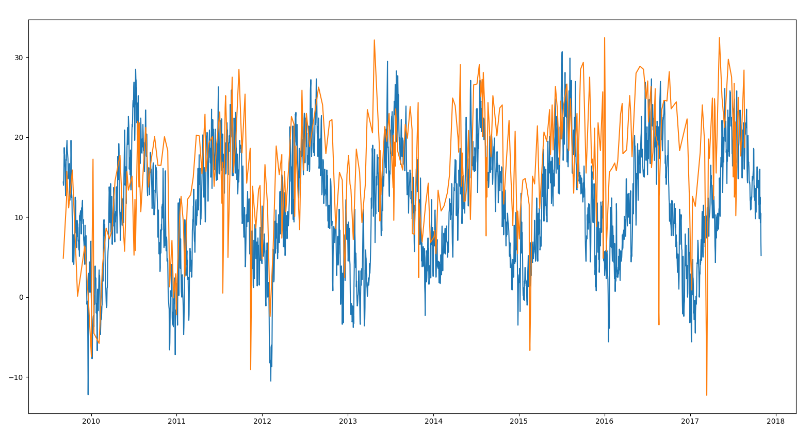

# Fuelly - Weather

See correlation of the fuel consumption of the car with the outside temperatures.

[Fuelly.com](http://fuelly.com/) allow it's users to store their mileage every time the fill some fuel in the car.
Hence the site calculates the distance you travelled and fuel used. So it shows you a nice chart of your fuel consumption during the years.

I'm learning Python and Machine Learning so I needed some data to play with. So I downloaded my own consumption data from Fuelly since 2010.

I know the fuel consumption is higher in winter when you have heating on and the motor needs heating as well.
The idea of this project is then to see if the consumption is really correlates with the outside temperatures.

I've downloaded weather data for my city from [European Climate Assessment &amp; Dataset](http://www.ecad.eu/dailydata/datadictionary.php).

After some numpy and pandas manipulations both the temperature and consumption data can be shown on the same chart.

Visually it looks like there is a correlation indeed.

It was useful for me as I've worked on my Python skills. Maybe you can learn something from this code as well.

Check it on [GitHub](https://github.com/spidgorny/fuelly-weather).
